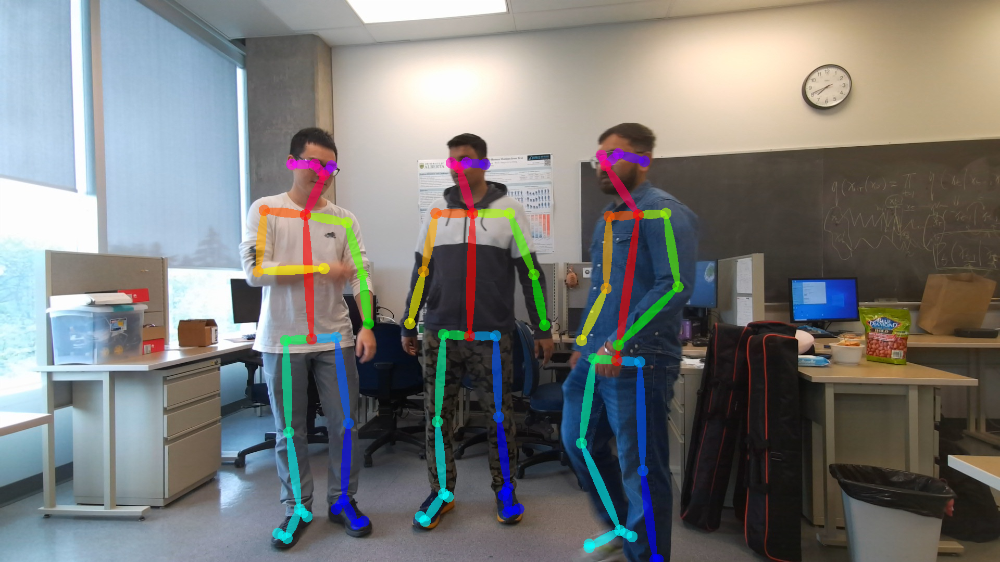

# CFI-Project-Updates
Hi! This is Archit Mangrulkar. This repository contains codes developed by me and my daily task updates for the CFI project

## Monday, May 15th 

1. The 2D pose estimation has been completed using OpenPose. It gives better results than MediaPipe as it performs multi-object pose estimation rather than focusing on one object. The latency for saving object pose images and their corresponding json files is 4.05 seconds/frame even after utilizing both the GPUs. Below is the result using OpenPose

    

2. I tried to perform human pose estimation using [HMR](https://github.com/akanazawa/hmr) however there were a lot of dependency issues when i tried to install and run it in my conda environment, mainly caused by improper installation of another python package opedr.

3. I tried to perform human pose estimation using [SPIN](https://github.com/nkolot/SPIN) however there were docker installation issues. Currrently I am trying to implement its [notebook]()

4. Me and Kinjawl read up on Camera Calibration from [slides shared by Shihao](https://docs.google.com/presentation/d/1j4qaADR2indMa6GZb5gB9bvG9nfOobQjJX-KBa_xq5o/edit#slide=id.gecbdb5d826_0_95) and [Stanford lecture notes](https://web.stanford.edu/class/cs231a/course_notes/01-camera-models.pdf)

5. Currently we are working on code for performing depth-to-color registration for a specific frame for all cameras. I'll update its results soon.

### Future Tasks

1. Transform the three 3D poses to the same coordinates using extrinsic calibration

2. Perform person tracking over time in this unified 3D view by verifying the extent of overlap between bounding boxes after tranformation of these 3D views

3. Use distortion parameters to get error free results

## Monday, May 12th

1. I removed some of the blurred images in our dataset. However the YOLLOv8 models run smoothly on our dataset, therefore removal of all blurred images was not needed. 

2. I worked on the pose estimation module. I used MediaPipe for this purpose however it does perform multi-object pose estimation rather it focuses on one object. Below is one of the results. I'll try to use other MediaPipe models in the meantime.

    

3. Kinjawl worked on the human detection model using two YOLOv8 models- the largest one with 700ms CPU latency and the smallest and least accurate model with 65.4 ms CPU latency

    

4. We had a online meeting with Shihao where he explained us the intrinsic & extrinsic camera calibration codes.  
### Assigned Tasks

1. Use OpenPose to achieve better pose estomation results

2. Perform 3D pose reconstruction from these 2D poses using depth2color calibration codes

3. Transform the three 3D poses to the same coordinates using extrinsic calibration

4. Perform person tracking over time in this unified 3D view by verifying the extent of overlap between bounding boxes after tranformation of these 3D views

5. Use distortion parameters to get error free results  

## Monday, May 11th

1. Shihao came over and explained the python client and the azure kinect c++ server codes. 

2. With Shihao's help we established a three camera setup and captured a small dataset of humans in the wild. 

    

### Assigned Tasks

1. Remove the blurred images in our dataset

2. Integrate the speech signal capture pipeline with our image capture pipeline by following the [Azure Speech SDK tutorial](https://learn.microsoft.com/en-us/azure/cognitive-services/speech-service/speech-sdk) 

3. Perform object detection using [OpenCV](https://opencv.org/) and pose estimation using [OpenPose](https://github.com/CMU-Perceptual-Computing-Lab/openpose), [MMpose](https://github.com/open-mmlab/mmpose)

## Monday, May 10th

1. Going through the [Azure Speech SDK tutorial](https://learn.microsoft.com/en-us/azure/cognitive-services/speech-service/speech-sdk). The tutorial is really helpful. The speech signal capture pipeline would be integrated with our main pipeline in a few days.

    

## Monday, May 9th

1. I have completed the reading up on the portion of Camera Calibration from [Multiple View Geometry in Computer Vision, Second Edition](http://www.r-5.org/files/books/computers/algo-list/image-processing/vision/Richard_Hartley_Andrew_Zisserman-Multiple_View_Geometry_in_Computer_Vision-EN.pdf)

2. Currently going through the [camera callibration codes](https://drive.google.com/drive/folders/1jtcK4WQyD9mzVvs61w-aSvgjQe_X-reO?usp=share_link) shared by Shihao. The next goal is to integrate the speech signal capture with our current work.

3. I helped Kinjawl with the project onboarding, explained him the data collection pipeline and shared some of the resources with him

## Monday, May 8th

This was my first meeting of the CFI project with Shihao, Vijay. The project involves data collection & calibration to produce 3D MoCap in the wild. We discussed the project objectives, environmental setup & future prospects. The project involves data capture in the wild, data processing and multimodality. There will be two test runs- on May 30th, June 11th and a final run probably in August.

### Data Collection Stage:
There will be 6 stationery Azure Kinect cameras, two non-stationary GoPros and eye trackers for recording the subjects. The cameras capture frames and write them to disk simaltaneously

    

### Data Processing:
This is the most important step as the data frames need to be time-synchronized.

### Multimodality:
Apart from the visual features, we can also incorporate Acoustic signals obtained from processing the speech captured by the Azure Kinect cameras and signals obtained from the eye-tracking glasses. There is also a possibility for capturing frames with drones, however calibrating this seems challenging

### Assigned Tasks

1. Read up Camera Calibration from [Multiple View Geometry in Computer Vision, Second Edition](http://www.r-5.org/files/books/computers/algo-list/image-processing/vision/Richard_Hartley_Andrew_Zisserman-Multiple_View_Geometry_in_Computer_Vision-EN.pdf)

2. The current pipeline captures only image frames periodically and performs the camera calibration. Develop a C++ based code for capturing speech inputs with our [Azure Kinect camera](https://azure.microsoft.com/en-us/products/kinect-dk#layout-container-uid9b7e)

### My Ideas

1. Possibility for Improvement in camera calibration? Can we achieve a better FPS? The current pipeline performs frame capture and writing to disk simaltaneously at 10 FPS. We can save the overhead of writing to disk simultaneously by writing to a small buffer memory first and then periodically writing to the disk.

2. Audio features can be extracted using tools such as [openSMILE](https://audeering.github.io/opensmile-python/), which is an open-source toolkit for extracting features from speech signals. We can extract features such as pitch, loudness, spectral features, and prosody features, which capture aspects such as the speaker’s intonation and rhythm. Further, the [librosa package](https://librosa.org/doc/latest/index.html) in Python can be used to extract audio features like Mel-frequency cepstral coefficients (MFCC) which are commonly used in speech recognition tasks

3. To capture the facial features, we can use the [OpenFace toolkit](https://cmusatyalab.github.io/openface/) which provides a deep neural network-based facial recognition system that extracts facial landmarks and expressions.

